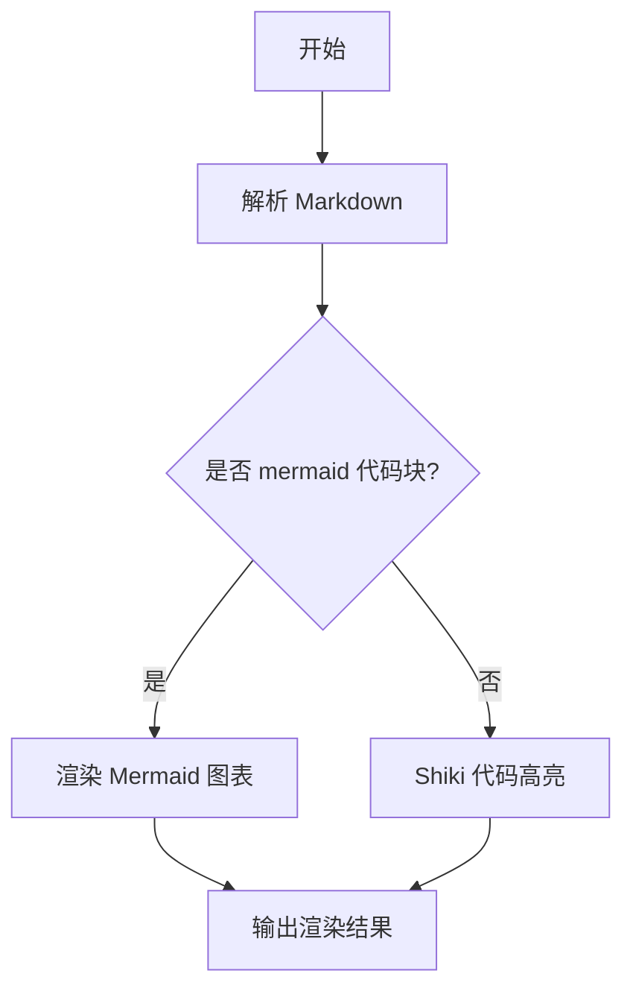

# 高级格式化

本文档介绍 Markdown 的高级格式化功能。

## 任务列表

```markdown
- [x] 已完成任务
- [ ] 未完成任务
- [ ] 另一个未完成任务
```

效果：

- [x] 已完成任务
- [ ] 未完成任务
- [ ] 另一个未完成任务

## 脚注

```markdown
这是一个脚注引用[^1]。

[^1]: 这是脚注的内容。
```

## 删除线

```markdown
~~删除的文本~~
```

效果：~~删除的文本~~

## 数学公式

### 行内公式

```markdown
质能方程 $E = mc^2$ 是物理学中最著名的公式之一。
```

### 块级公式

```markdown
$$
\sum_{i=1}^{n} x_i = x_1 + x_2 + \cdots + x_n
$$
```

## 定义列表

```markdown
术语 1
: 定义 1

术语 2
: 定义 2a
: 定义 2b
```

## 缩写

```markdown
*[HTML]: Hyper Text Markup Language
*[CSS]: Cascading Style Sheets

HTML 和 CSS 是前端开发的基础。
```

## 代码高亮

支持多种编程语言的语法高亮：

### JavaScript

```javascript
const greeting = (name) => {
  return `Hello, ${name}!`;
};

console.log(greeting("World"));
```

### Python

```python
def greet(name):
    return f"Hello, {name}!"

print(greet("World"))
```

### Go

```go
package main

import "fmt"

func main() {
    fmt.Println("Hello, World!")
}
```

### Rust

```rust
fn main() {
    println!("Hello, World!");
}
```

### TypeScript

```typescript
interface User {
  id: number;
  name: string;
}

const user: User = {
  id: 1,
  name: "John",
};

console.log(user);
```

## Mermaid 文本画图

使用 `mermaid` fenced code block 可以直接渲染流程图等图表：



## 表格高级用法

### 对齐方式

```markdown
| 左对齐 | 居中 | 右对齐 |
|:-------|:----:|-------:|
| 内容   | 内容 | 内容   |
```

效果：

| 左对齐 | 居中 | 右对齐 |
|:-------|:----:|-------:|
| 内容   | 内容 | 内容   |

## 组合格式

### 嵌套列表

```markdown
1. 第一项
   - 子项 1
   - 子项 2
2. 第二项
   - 子项 1
     - 更深层的子项
```

### 引用中的代码

```markdown
> 这是一个引用
> 
> ```javascript
> console.log("代码块在引用中");
> ```
```

## HTML 标签

Markdown 支持 HTML 标签：

```html
<div style="color: red;">
  这是红色的文本
</div>

<details>
<summary>点击展开</summary>

这里是隐藏的内容。

</details>
```

<details>
<summary>点击展开</summary>

这里是隐藏的内容。

</details>

## 下一步

- [教程 1](../tutorials/tutorial-1.md) - 开始实践
