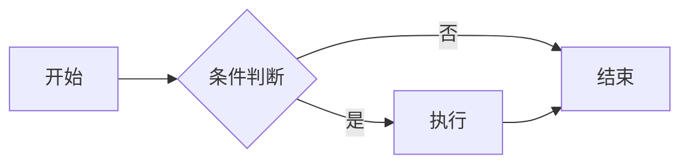
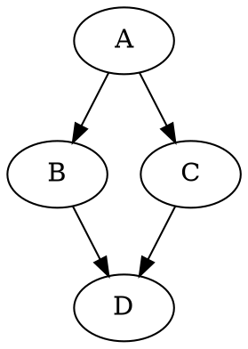
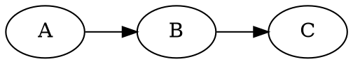
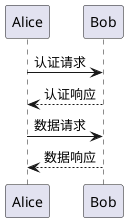

# 图表引擎

mdserve 支持两类图表渲染：

- **Mermaid**：开箱即用，浏览器端渲染，无需任何配置。
- **Kroki**：通过自托管 [Kroki](https://kroki.io) 容器，支持 d2 / plantuml / graphviz 等数十种 DSL。需在 `.mdserve.yaml` 中配置。

> 启用 Kroki 的方法见 [图表引擎部署指南](../../docs/guide/diagrams.md)。

## Mermaid（默认可用）



## d2

```d2
x -> y: hello
y -> z: world
```

## Graphviz（`dot`）

`dot` 是 `graphviz` 的别名，二者等价：



也可以直接使用 `graphviz`：



## PlantUML（`puml`）

`puml` / `pu` 都是 `plantuml` 的别名：



## Structurizr（`c4`）

`c4` / `c4model` 是 `structurizr` 的别名：

```c4
workspace {
    model {
        user = person "User"
        softwareSystem = softwareSystem "Software System"
        user -> softwareSystem "Uses"
    }
    views {
        systemContext softwareSystem "Diagram" {
            include *
        }
    }
}
```

## 更多引擎

mdserve 通过 Kroki 还支持：`excalidraw`、`wavedrom`、`nomnoml`、`bytefield`、`erd`、`pikchr`、`svgbob`、`blockdiag`、`actdiag`、`seqdiag`、`nwdiag`。

```nomnoml
[Pirate|eyeCount: Int|raid();pillage()|
  [beard]--[parrot]
  [beard]-:>[foul mouth]
]
```

```svgbob
  _____
 /     \
| () () |
 \  ^  /
  |||||
  |||||
```

## 别名速查

| 输入别名 | 归一化引擎 |
|---|---|
| `dot` | `graphviz` |
| `c4`、`c4model` | `structurizr` |
| `pu`、`puml` | `plantuml` |

## 未配置时的体验

若未配置 Kroki，以上非 Mermaid 的图表会显示「未配置 Kroki」的友好提示，并附带 `docker run` 命令与 `.mdserve.yaml` 配置示例，方便快速启用。
